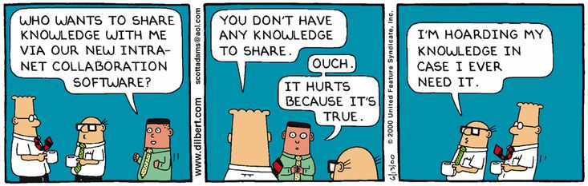

# Ways to Handle Unresponsive Subject Matter Experts (SMEs) <!-- omit in toc -->

- [Introduction](#introduction)
- [Cooperation with SMEs: Essential for Several Reasons](#cooperation-with-smes-essential-for-several-reasons)
- [Challenges of Working with SMEs](#challenges-of-working-with-smes)
- [Ways of Getting SMEs to Work with Us](#ways-of-getting-smes-to-work-with-us)

## Introduction

Dealing with unresponsive Subject Matter Experts (SMEs) can pose challenges, particularly when documenting complex products, services, or systems. For those less experienced, having a reliable resource for handling intricate matters, such as an SME, is crucial. The question arises: How vital is cooperation with SMEs in IT?

## Cooperation with SMEs: Essential for Several Reasons

1. **Expertise:** SMEs possess in-depth understanding in their specialized areas, guiding the IT team in developing efficient and industry-standard solutions.

2. **Quality Assurance:** SMEs contribute to the quality of IT projects by offering expert opinions and feedback, identifying potential issues or improvements.

3. **Training and Support:** SMEs provide training and support, aiding the IT team in comprehending complex subject matter, leading to improved problem-solving and decision-making.

4. **Communication Bridge:** Acting as a bridge between the IT team and stakeholders, SMEs translate technical jargon into understandable terms, enhancing communication.

5. **Risk Mitigation:** Involving SMEs helps mitigate risks associated with a lack of knowledge, preventing costly mistakes and rework.

**Conclusion:**
SMEs play a crucial role in IT projects, contributing to success, efficiency, better outcomes, higher quality, and increased stakeholder satisfaction.

## Challenges of Working with SMEs

1. **Availability:** SMEs' busy schedules may lead to delays and communication gaps.

2. **Communication:** SMEs' use of technical language may cause misunderstandings.

3. **Perspective:** SMEs may lack a broad understanding of IT constraints and challenges, leading to unrealistic expectations.

4. **Resistance to Change:** SMEs' resistance to new ideas may result in conflicts and slow progress.

5. **Knowledge Transfer:** Effectively transferring SMEs' knowledge to the IT team can be challenging.

Despite these challenges, the benefits of working with SMEs often outweigh the difficulties. Effective communication, mutual respect, and understanding can help mitigate these challenges.

## Ways of Getting SMEs to Work with Us

Motivating SMEs in IT to cooperate can be achieved through several strategies:

1. **Recognition:** Acknowledge and appreciate the expertise and contribution of SMEs.

2. **Clear Communication:** Ensure SMEs understand the importance of their role in project success.

3. **Involvement:** Include SMEs in decision-making processes related to their expertise to make them feel valued.

4. **Support:** Provide SMEs with necessary resources, including time, tools, and training.

5. **Building Relationships:** Foster positive working relationships with SMEs by respecting their expertise, listening to their ideas, and being open to feedback.

6. **Incentives:** If possible, offer meaningful incentives such as professional development opportunities or financial rewards.

Remember, understanding individual motivations is crucial, and tailoring the approach accordingly is essential.
